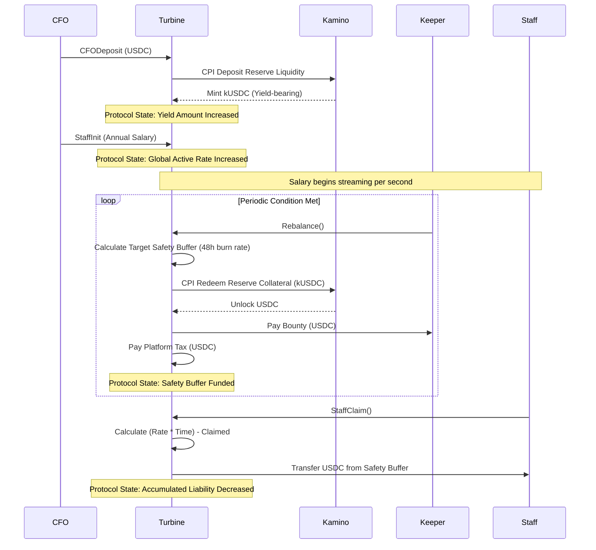

# Yield-Optimized Continuous Payroll Protocol

## System Overview

This is a Solana-based, capital-efficient payroll contract. It solves the systemic inefficiency of idle corporate treasury capital. Instead of locking USDC in a dead vault to cover payroll, this protocol actively deploys deposited capital to Kamino Finance to generate continuous yield.

The contract utilizes a two-tier liquidity architecture:

1. **The Yield Vault (Kamino kUSDC):** The primary storage for capital, generating constant yield.
2. **The Safety Buffer (Liquid USDC):** A localized, dynamically rebalanced pool used strictly to fulfill immediate, real-time employee salary claims.

## Architecture & Power Dynamics

This contract shifts the burden of liquidity management from the protocol to decentralized, incentivized actors (Keepers) through a mathematically enforced rebalancing system.

### Core State: The Protocol Vault

The central nervous system of the protocol. It tracks total system liability in real-time, completely decoupling individual employee claims from the global accounting state.

```rust
pub struct ProtocolVault {
    pub safety_current_amount: u64,           // Liquid USDC ready for withdrawal
    pub yield_total_amount: u64,              // Yield-bearing kUSDC balance
    pub global_active_rate: u64,              // Total protocol burn rate per second
    pub accumulated_liability: u64,           // Total unpaid, accrued salary
    pub last_liability_update_timestamp: u64  // Time vector for continuous calculation
}

```

### The Capital Flow Mechanics



## Instruction Set & Execution Logic

### 1. Initialization & Capital Injection

* `CFOInit`: Allocates the PDA memory space and zeroes out the global ledger.
* `CFODeposit`: The entry point for capital. Accepts raw USDC, executes a Cross-Program Invocation (CPI) to Kamino Finance, and logs the exact minted kTokens to ensure zero precision loss during yield accounting.

### 2. The Keeper Rebalance Engine

This is the systemic defense mechanism. The contract does not hold idle USDC unless required. When the `safety_current_amount` drops below the `protocol_vault_target` (e.g., 48 hours of total protocol burn rate), any external bot/keeper can call `Rebalance`.

If the yield covers the required extraction and the keeper bounty + platform tax, the protocol liquidates just enough kUSDC from Kamino to restock the safety buffer.

```rust
// Empirical Rebalance Economics
let daily_burn_rate = self.global_active_rate * 3600 * 24;
let two_days = 2;
let protocol_vault_target = (daily_burn_rate * two_days * 12) / 10; // 120% of 48h burn

```

### 3. Continuous Payroll Distribution

* `StaffInit`: Calculates the `rate_per_sec` based on the annualized salary and adds it to the protocol's `global_active_rate`.
* `StaffClaim`: Executes a Just-In-Time (JIT) liability update. It calculates `(rate_per_sec * time_passed) - total_claimed` and debits the liquid Safety Buffer directly to the employee's wallet. If the Safety Buffer is empty, it reverts with `InsufficientProtocolVault`, signaling that Keepers must rebalance.
* `StaffRemove`: Forces a final claim, subtracts the employee's rate from the `global_active_rate`, and executes an Anchor `close` command to garbage-collect the account memory and return the rent lamports.

## Security & Invariant Guarantees

1. **Strict Isolation:** Employees can never directly withdraw from Kamino. They only interact with the `safety_current_amount`.
2. **Economic Deferral:** Rebalance operations automatically abort (`Ok(())` without execution) if the required extraction is smaller than the economic cost of the Keeper bounty and Platform Tax.
3. **Time Vector Integrity:** Every state-altering instruction (Deposit, Claim, Init) forces an immediate update to `accumulated_liability` before execution to prevent systemic time-drift exploitation.
